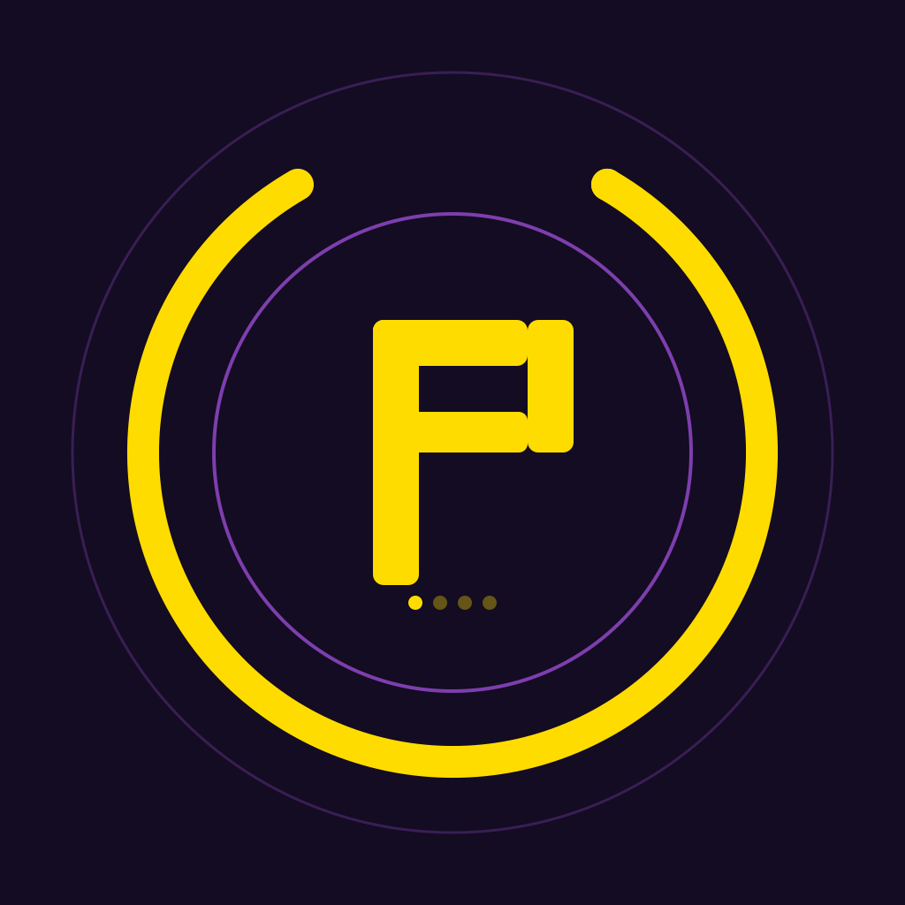
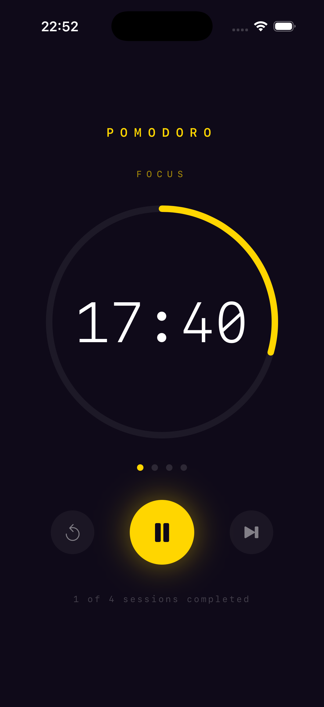
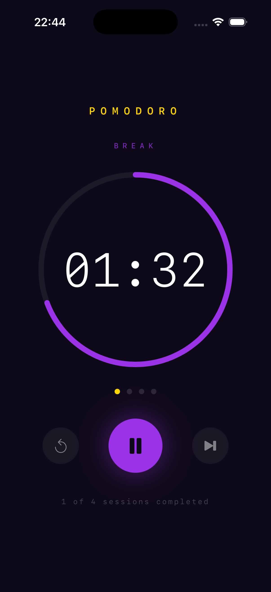
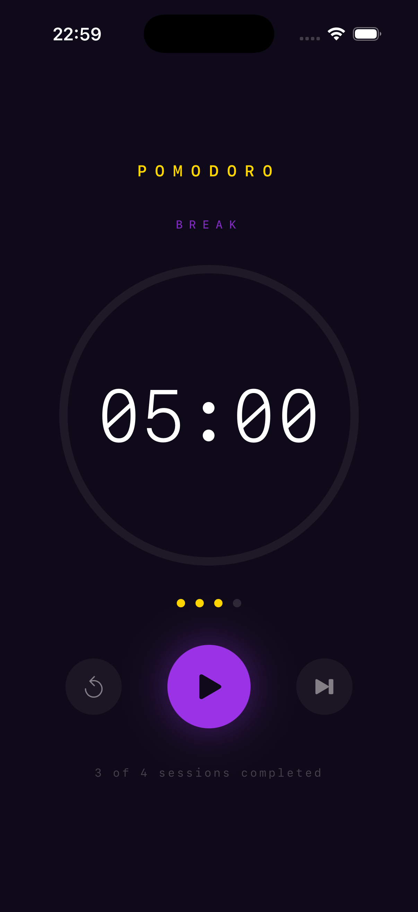

# Pomodoro

A clean and minimal Pomodoro timer built with SwiftUI.

## Features
- 25/5 minute Focus and Break sessions
- Circular progress ring
- Session counter (4 Pomodoros goal)
- Start, Pause, Reset and Skip controls
- Black, purple and gold design

## Tech
- Swift 5
- SwiftUI
- Timer API

## App Icon

## Screenshots

