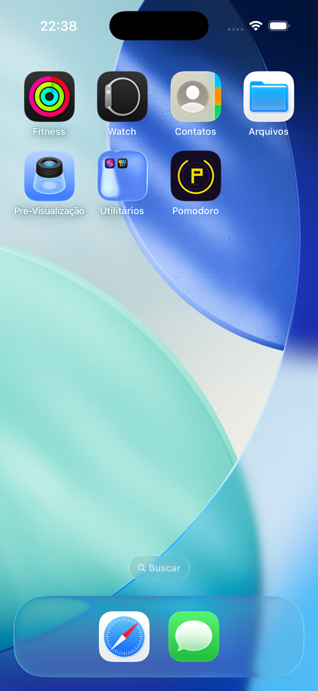

<div align="center">


# Pomodoro

A clean and minimal Pomodoro timer built with SwiftUI.

[Demo](#demo) • [Features](#features) • [Tech](#tech) • [Run it](#run-it-locally)

</div>

## Demo

<a href="assets/demo.mp4">
  
</a>

> Click the image above to watch the 7-second demo (sped up 3×).
> For an inline preview, drag `assets/demo.mp4` into the GitHub README web editor.

## Features

- 🎯 25/5 minute **Focus** and **Break** sessions
- 🌀 Animated **circular progress ring**
- 🔁 Session counter — 4 Pomodoros per cycle
- ▶️ **Start**, **Pause**, **Reset** and **Skip** controls
- 🌙 Dark UI with **gold** (focus) and **purple** (break) accents

## Tech

| | |
|---|---|
| Language | Swift 5 |
| UI Framework | SwiftUI |
| Time API | `Timer.scheduledTimer` |
| Min iOS | 17.0 |
| Tools | Xcode 17 |

## Screenshots

<p align="center">
  
  
</p>

## Run it locally

```bash
git clone https://github.com/Alissonnascimento74/Pomodoro-ios.git
cd Pomodoro-ios/Pomodoro
open Pomodoro.xcodeproj
```

Then hit **Run** (⌘R) in Xcode with any iPhone simulator selected.

## Roadmap

- [ ] Background timer (keep counting when the app is in the background)
- [ ] Custom session durations
- [ ] Haptic feedback on session transitions
- [ ] Sound notification when a session ends
- [ ] Long break after 4 Pomodoros

## About

Built as my first real iOS project while learning Swift and SwiftUI.
Each commit is part of the journey — feel free to follow along.

— [@Alissonnascimento74](https://github.com/Alissonnascimento74)
